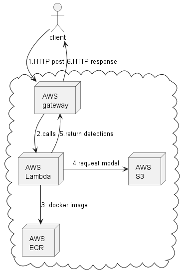

# mlapi

# Requirements
* [AWS CLI](https://aws.amazon.com/ko/cli/)
* [Python 3](https://www.python.org/downloads/)
* [AWS SAM CLI](https://aws.amazon.com/ko/serverless/sam/)
* Docker CLI

# Create an ECR repository
```
aws ecr create-repository --repository-name lambda-pytorch-example --image-scanning-configuration scanOnPush=true --region <REGION>
```

# Register docker to ECR
```
aws ecr get-login-password --region <REGION> | docker login --username AWS --password-stdin <AWS_ACCOUNT_ID>.dkr.ecr.<REGION>.amazonaws.com
```

# Deploying the application
```
sam build && sam deploy –-guided
```


# Workflow

Here's the architecture of the backend:

<p align="center">
 
</p>

- The backend and the frontend communicate with each other over HTTP requests. Here is the workflow:
  - An image is sent from the client through POST request
  - The image is then received via API Gateway
  - API Gateway triggers a Lambda function to execute and passes the image to it
  - The docker image consists of lambda function and dependencies are loaded from AWS ECR
  - The Lambda function starts running: it first fetches the pretrained models from S3 and detects objects from the given image
  - Once the Lambda function is done running, it sends the detection result back to the client through API Gateway.


# Reference
* [aws:using-container-images-to-run-pytorch-models-in-aws-lambda](https://aws.amazon.com/ko/blogs/machine-learning/using-container-images-to-run-pytorch-models-in-aws-lambda/)
# [aws:Enable CORS on a resource using the API Gateway console](https://docs.aws.amazon.com/apigateway/latest/developerguide/how-to-cors-console.html)

